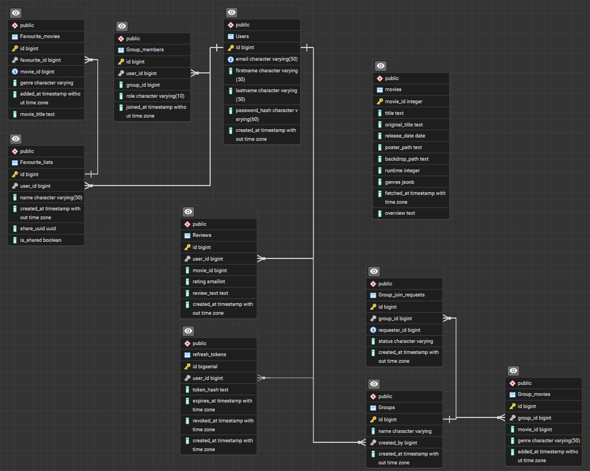

# MovieApp
Student project – Fullstack
Course name: *Web programming app project*.

Web application for movie enthusiasts. 
Users can browse movies, write reviews, join groups, search showtimes and add favorites.
Utilisizes The Movie Database (TMDB) and Finnkino APIs.

## Documentation

### API documentation
The MovieApp backend API has been fully documented and tested using **Postman**.  
The documentation includes all authentication, user, movie, review and favourite list endpoints,  
along with example requests, responses and error cases.

[View the full API documentation here](https://documenter.getpostman.com/view/41009671/2sB3QKq9eq)

### Database
Database runs on PostgreSQL database. 


## Technologies
#### Frontend:
<ol>
   <li>React (Vite)</li>
   <li>React Router DOM</li>
   <li>React hot toast</li>
   <li>React DOM</li>
   <li>Axios</li>
   <li>fast-xml-parser</li>
   <li>fortawesome</li>
</ol>

#### Backend
<ol>
   <li>Node.js</li>
   <li>Express</li>
   <li>cors</li>
   <li>bcrypt</li>
   <li>fast-xml-parser</li>
   <li>jsonwebtoken</li>
   <li>npx</li>
   <li>pg</li>
   <li>cookie-parser</li>
   <li>uuid</li>
   <li>chai</li>
   <li>cross-env</li>
   <li>mocha</li>
   <li>dotenv</li>
   <li>nodemon</li>
</ol>

- Dokumentaatio: OpenAPI (Swagger), dbdiagram.io
- Versionhallinta: GitHub

## Project structure
```
MovieApp/
  client/            # React frontend
   /components       # Reusable components
   /context          # Contexts, such as user info
   /screens          # Views that correspond routes
      /account       # User management, Login, Signup jne.
  server/            # Node/Express backend
   /controllers      # App logic (for example. userController.js, reviewController.js)
   /helpers          # Small helper functions
   /middleware       # For example auth.js
   /models           # Database logic
   /service          # Outside integrations to Finnkino and TMDB
  docs/              # openapi.yaml, charts, backlog-pictures
  .gitignore
  README.md
```

## Routes
Defined frontend routes
   /home
   /login
   /signup
   /myinfo
   /search
   /favorites
   /shared/favourites/:uuid
   /groups
   /reviews
   /theater
   /theater/shows/?area=xxxx&dt=dd.mm.yyyy
   /theater/locations/

## Cloning and initalization
1. Kloonaa repo omalle koneellesi:
   ```bash
   git clone <repo-url>
   cd MovieApp
   ```

2. Asenna frontendin (React) riippuvuudet:
   ```bash
   cd client
   npm install
   ```

3. Asenna backendin (Express) riippuvuudet:
   ```bash
   cd ../server
   npm install
   ```

4. Käynnistä palvelut:
   - Frontend:
     ```bash
     cd client
     npm run dev
     ```
     → http://localhost:5173

   - Backend:
     ```bash
     cd server
     npm run devStart
     ```
     → http://localhost:3001

Notice:
- `node_modules/`-directory is not in the repository. It´s always created with `npm install`-command.
- All the necessary libraries and their versions are defined in `package,json` + `package-lock.json` files. `npm install` installs same environment to everyone.
- `.env`-file must be created to `server/` and `client/`-directories.


### Environment variables
#### Frontend
Create .env file to path: `client/`

VITE_API_URL=http://localhost:3001
VITE_API_FINNKINO_URL=https://www.finnkino.fi/xml
VITE_TMDB_TOKEN=xxxx
VITE_TMDB_KEY=xxxx

#### Backend
Create .env file to path: `server/`
```
PORT=3001

#Frontend address
FRONTEND_URL=http://localhost:5173

#In http this is "development"
#in production this is "production"
NODE_ENV=false

#This is either "testing" or "production"
#testing uses local database.
#production uses Render database
DB_ENV="production"

# Render Postgres connection
DB_HOST=xxx
DB_PORT=xxxx
DB_USER=xxx
DB_PASSWORD=xxxx
DB_NAME=xxxx
DUMMY_HASH=xxxx

#Test database connection
TEST_DB_URL=http://localhost:3001
TEST_DB_HOST=xxxxx
TEST_DB_PORT=xxxx
TEST_DB_USER=xxxxx
TEST_DB_PASSWORD=xxxx
TEST_DB_NAME=xxxxx


#JWT
JWT_SECRET_KEY=xxxx
REFRESH_TOKEN_MS=xxxx

TMDB_BEARER_TOKEN=xxxx
```
